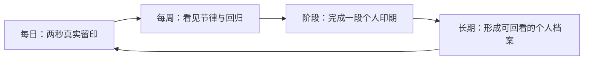

# 一日一印（Pulse）1.x–3.0 产品战略与商业化规划

文档版本：0.1  
状态：Proposed Strategy，不改变 1.0 已冻结发布范围  
评审日期：2026-08-11

本文回答四个问题：这个项目是否值得继续、应该成为什么、哪些能力适合收费、以什么证据决定继续或停止。具体实施顺序见 [POST_1_0_ROADMAP.md](./POST_1_0_ROADMAP.md)。

## 1. 结论

### 1.1 战略判断：有条件 GO

Pulse 值得继续，但前提不是“继续堆功能”，而是守住并放大一个清晰位置：

> 一日一印不是多习惯待办清单，而是为一个重要承诺，每天留下一个真实、私密、可长期理解的印记。

当前项目的工程底座显著强于普通 MVP：逻辑日、时区、唯一性、导入恢复、提醒、失败语义、动态字体和双语都已经形成正式合同。它具备持续开发的条件。

当前项目尚未证明三件事：真实用户会长期回来、用户为什么选择它而不是成熟竞品、用户愿意为什么持续付费。因此，当前状态必须分开表述：

| 维度 | 当前结论 | 原因 |
| --- | --- | --- |
| 工程基础 | GO | 事实模型、写入入口、测试与失败处理已成体系 |
| 1.0 公开发布 | NO-GO | 真机、通知、最终视觉、签名分发与连续使用门禁未关闭 |
| 产品差异化 | CONDITIONAL GO | “一个承诺、一次真实留印、无压力恢复”有空间，但尚未经用户验证 |
| 付费上线 | NO-GO | 还没有被验证的长期价值与付费功能组合 |
| 持续投入 | GO，带阶段门槛 | 先发布与验证，再依证据投入 Widget、Plus、同步和 Watch |

### 1.2 最重要的纠偏

以下直觉看似合理，实际上会伤害项目：

- “多习惯”不是自然升级，而是把产品改造成竞争最拥挤的通用习惯追踪器，并破坏当前单一主操作和主项目唯一合同。
- “AI 教练”不是高阶功能的同义词。没有足够个人数据、明确建议边界和隐私方案时，它只是成本更高的通用文案生成器。
- “补签、冻结连续天数”会让历史看起来更好，却削弱记录可信度。Pulse 应允许解释中断，不应伪造完成事实。
- “云同步”不是打开一个 Capability。当前 SwiftData 唯一约束、冲突策略、删除传播和离线写入都需要正式同步合同。
- “订阅”不是可持续发展的起点。订阅必须先有持续产生的价值，不能只把本地开关和主题租给用户。

## 2. 第一性原理：用户真正购买什么

用户并不缺少一个能打勾的按钮。系统提醒事项、日历、备忘录和大量免费习惯 App 都能完成打勾。

Pulse 能创造的价值由四部分组成：

1. **低摩擦**：今天不需要重新计划，两秒内完成一次重要动作。
2. **可信事实**：签到、缺席、时区和删除都不被装饰性机制篡改。
3. **温和回归**：中断不是惩罚，也不靠补签抹除；用户能看见自己如何回来。
4. **时间复利**：记录越久，个人节律、阶段变化和年度档案越有价值。

可持续商业化必须把“时间复利”做深。仅靠新增颜色、图标或习惯数量，价值不会随使用时间增长，用户也没有理由年年续费。

## 3. 产品定位与目标用户

### 3.1 核心定位

中文定位：

> 为一个重要承诺，每天留下一枚真实的印记。

英文定位：

> One meaningful commitment. One honest imprint a day.

产品类别应优先选择“私密的日常节律工具”，而不是“全能效率工具”“任务管理器”或“社交打卡社区”。

### 3.2 首要用户

首要用户不是想同时管理十几个目标的人，而是以下三类：

- **单锚点坚持者**：当前只想守住一个最重要的日常承诺，如阅读、创作、复盘或训练。
- **厌倦断签焦虑的人**：需要看到连续性，但不接受火焰、羞辱、排名和虚假冻结。
- **隐私敏感的长期记录者**：不愿注册账号或上传行为数据，希望记录可导出、可恢复、可长期阅读。

暂不服务：团队考勤、证明与防作弊、多项目重度规划、公开社区、医疗依从性或临床建议。

### 3.3 三层产品循环



每日循环保证留存，周循环提供理解，阶段循环提供意义，长期档案形成迁移成本和付费价值。

## 4. 当前项目审阅

### 4.1 已经形成的资产

- `CheckInRecord` 是历史和统计的唯一事实源，不持久化连续天数等派生状态。
- `recordKey`、SwiftData 唯一约束和 Repository 幂等写入共同保护同日唯一性。
- 项目创建时区、当前签到时区和记录发生时区分开保存，历史不会随设备时区漂移。
- JSON v1 有格式标识、大小与数量上限、时间顺序和来源校验，失败前不删除现有事实。
- 所有写入集中在 `SwiftDataCheckInRepository`，AppModel 串行化操作，提醒使用快照与 revision 防止陈旧结果回写。
- 品牌、双语、动态字体、Reduce Motion、iPhone/iPad 布局和错误状态已经进入正式实现。

这些能力本身不直接带来下载量，但它们决定了产品能否承载多年数据和后续付费承诺。

### 4.2 当前产品缺口

- 用户还不能清楚表达“我每天为什么签到”。`Habit.name` 存在，但没有形成首启确认、重命名和承诺说明的完整体验。
- 现有统计只回答累计与连续，没有回答“最近是否稳定”“中断后多久回来”“哪个阶段更适合我”。
- 记录只有完成事实，没有可选的轻量上下文，也没有真实的缺席说明。
- 没有 Widget、Watch、同步和付费权益基础设施。
- 没有真实留存、付费转化或目标用户访谈证据。
- 发布合同已记录公开隐私政策与产品支持 URL，App 内集中链接也正在纳入实现；但对应 `site/` 源码当前仍是独立、未纳入主仓版本控制的嵌套工作区。公开可访问性、部署版本与本地源码一致性、App Store Connect 元数据仍需作为发布证据分别确认。

## 5. 市场与竞品快照

以下是 2026-08-11 的美国 App Store / 官方站点快照，价格和功能会变化，实施定价前必须重新核对。

| 产品 | 已形成的强项 | 当前商业信号 | 对 Pulse 的含义 |
| --- | --- | --- | --- |
| [Streaks](https://apps.apple.com/us/app/streaks/id963034692) | 最多 24 个任务、Widget、Watch、Health、iCloud、强原生体验 | 买断 $5.99，约 27K 评分 | 原生整合很重要，但“多任务 + 连续天数”已有强者且价格低 |
| [Habitify](https://apps.apple.com/us/app/habitify-habit-tracker/id1111447047) | 多平台、自动追踪、图表、提醒、Health 与自动化 | $8.99/月、$49.99/年、$119.99 永久，约 7K 评分 | 全能追踪器必须承担很高的平台和集成成本 |
| [everyday](https://apps.apple.com/us/app/everyday-habit-tracker/id1394150432) | 视觉链条、多端、Watch、长期进度板 | $29.99/年、$99.99 永久，约 4.5K 评分 | 漂亮的连续可视化能收费，但“三个免费习惯”式限制也会引发反感 |
| [Productive](https://apps.apple.com/us/app/productive-habit-tracker/id983826477) | 课程、挑战、文章、智能/位置提醒、趋势 | 订阅，约 91K 评分 | 内容与教练路线需要持续内容运营，不适合当前团队直接复制 |
| [Daylio](https://apps.apple.com/us/app/daylio-journal-mood-tracker/id1194023242) / [DailyBean](https://apps.apple.com/us/app/dailybean-simplest-journal/id1553223828) | 心情、微日记、生活记录 | 分别约 61K / 70K 评分 | “加心情和日记”会进入另一个成熟红海 |
| [Oneline](https://apps.apple.com/us/app/oneline-daily-log-journal/id6758101912) / [Olad](https://apps.apple.com/us/app/olad-one-line-a-day-journal/id6764331341) | 一行日记、回顾、私密、无压力 | 新产品也在持续进入；Olad 采用 $39.99 永久 | “每天一行”本身不构成差异化，必须与真实留印和节律理解结合 |

市场空位不是缺功能，而是缺少一个同时满足以下条件的清晰产品：

- 只守一个重要承诺；
- 不用补签、冻结和排行榜制造表面连续；
- 把中断后的回归能力视为值得理解的数据；
- 本地优先、可导出，并逐步提供私密同步；
- 用阶段与长期档案积累意义，而不是把首页变成任务清单。

## 6. 功能组合与收费边界

### 6.1 永久免费的产品底线

以下能力属于产品承诺，不能被付费墙劫持：

- 一个当前主承诺及每日一次可靠签到；
- 今日、最近七天、月历、累计、当前连续和最长连续；
- 一个本地提醒、时区、一周起始日、主题、双语和完整无障碍；
- 删除、清除、JSON 导出和恢复；
- 所有已有数据的阅读和再次导出；
- 主承诺命名与一句“为什么重要”；
- 基础 Home / Lock Screen Widget；
- 基础缺席说明：说明事实，但不把缺席改成完成；
- 一张带最小品牌署名、默认不暴露私密内容的基础分享卡。

把导出、读取历史、无障碍、隐私锁或基本提醒放到付费层，会直接削弱信任，不建议。

### 6.2 Pulse Plus 应售卖的高阶价值

| 能力 | 产品表达 | 为什么可收费 | 首次优先级 |
| --- | --- | --- | --- |
| 节律实验室 | 7/28/90/365 日滚动完成率、回归间隔、星期/时段分布、阶段对比 | 从多年事实中持续产生新理解 | P0 Plus |
| 回归力 | 统计首次中断后的返回速度、典型恢复周期，不改变签到事实 | 与“无压力但真实”的定位高度一致 | P0 Plus |
| 个人印期 | 为一个主承诺建立连续的阶段、意图、起止与结业回顾；只允许一个当前阶段 | 形成可回看的长期档案，不落入同时管理多习惯 | P0 Plus |
| 每周/月度回响 | 由本机数据生成可编辑回顾：发生了什么、何时最稳、如何回来 | 每周、每月持续产生价值，支撑年费 | P0 Plus |
| 高级档案与分享 | 年轮、阶段海报、无私密内容模式、高分辨率/PDF 导出 | 个性表达与自然传播，不需要社区后台 | P1 Plus |
| 私密自动同步 | iPhone/iPad 后台同步、冲突可解释、离线可写、可关闭 | 持续维护价值；JSON 仍保留为免费逃生口 | P1 Plus |
| Apple Watch | 今日状态、并发安全签到、并发症/Widget、离线后协调 | 高价值便利入口，需要持续系统适配 | P1 Plus |
| 高级 Widget / Control | 节律、阶段进度、外观与交互配置 | 个性与便利，但基础入口必须免费 | P1 Plus |
| 自定义观察维度 | 用户选择少量维度，如精力、专注或场景，并获得本地模式分析 | 个性化来自用户自己的数据，不依赖通用 AI | P2 Plus |
| 可选照片印记 | 每日最多一张、明确存储与导出边界 | 增强纪念价值，但显著放大存储、同步和隐私成本 | 只做验证实验 |

### 6.3 建议暂缓或拒绝

| 方向 | 结论 | 原因 |
| --- | --- | --- |
| 多个并行习惯 | HOLD | 需求可能存在，但会重写定位、导航、统计、提醒和数据模型；先验证“一个承诺”是否成立 |
| 补签 / 连续冻结 | NO-GO | 制造漂亮数字但破坏事实；改做缺席说明和回归力 |
| 公开社区 / 排行榜 | NO-GO | 与私密、无压力冲突，还引入账号、审核、举报和内容安全成本 |
| 积分商城 / 虚拟货币 | NO-GO | 与品牌语言不一致，且创造的是外部奖励而非长期理解 |
| 广告 | NO-GO | 破坏安静与隐私定位，单位用户价值也不足以覆盖品牌损失 |
| 通用 AI 教练 | NO-GO 直至有证据 | 隐私、成本、正确性和差异化都未解决 |
| 团队考勤 / 证明 | NO-GO | 当前数据模型不具备防作弊与审计属性，不应暗示证明效力 |
| 位置提醒、Health 全量接入 | HOLD | 属于通用追踪器标配，但并不服务“一个每天承诺”的首要差异 |

## 7. 商业模式

### 7.1 建议模型

应用免费下载，核心永久免费；高级能力使用一个统一权益 `Pulse Plus`：

- 年付：主推，提供明确试用期；
- 永久版：面向反订阅和长期记录用户；
- 暂不提供周付，也不以首启强制全屏付费墙阻断第一次签到；
- 年付和永久版权益相同，不制造难以解释的“永久本地版 / 订阅云端版”平行真源；
- 试用只在用户主动进入 Plus 并确认后开始，不在第一次启动静默计时。

初始测试价格带，而不是最终承诺：

| 阶段 | 年付建议 | 永久版建议 | 前提 |
| --- | --- | --- | --- |
| Plus 首发测试 | US$14.99–19.99 | US$39.99–59.99 | 节律、印期、持续回响、私密同步均可用 |
| 价值成熟后 | US$24.99–29.99 | US$69.99–89.99 | Watch、稳定同步、高级档案和持续更新已被使用证据证明 |

中国区不应把美元机械换算成人民币。应在 App Store Connect 选择基准地区与本地价格点，核对税费、购买力和竞品后再决定。Apple 当前允许按基准地区为其他店面自动生成可比价格，并提供大量价格点。

### 7.2 订阅伦理与退出语义

- 订阅到期后，不删除、不隐藏、不降级用户已有事实、注释、印期和报告。
- 到期用户仍可查看和导出全部数据；只停止新的 Plus 计算、同步写入或高级创建。
- 同步停止前必须完成本地落盘，并清楚显示最后同步时间和未同步状态。
- StoreKit 商品加载失败时显示诚实错误，不展示虚构价格，不使用硬编码兜底商品。
- 必须提供恢复购买、管理订阅、隐私政策和使用条款入口。

Apple 的现行审核规则要求自动续期订阅持续为用户提供价值，并在用户设备间可用。数字功能必须使用合规的 App 内购买路径。实现时以 [App Review Guidelines](https://developer.apple.com/app-store/review/guidelines/) 和 [StoreKit 2](https://developer.apple.com/storekit/) 为准。

### 7.3 单位经济的初始模型

若符合 App Store Small Business Program，Apple 当前对付费 App 和 App 内购买提供 15% 佣金率；资格与关联开发者账户必须实际确认。预算不能按 100% 标价收入计算。

建议每季度看四个数：

- 激活用户到付费用户的转化率；
- 年付 / 永久版结构；
- 退款率与年付流失；
- 每个付费用户带来的支持、同步和开发成本。

永久版不应无限低价。它承诺长期系统适配和数据可读性，定价至少应接近 3–4 年年费的折现值。

## 8. 增长方式

Pulse 不适合依赖社交 feed，但可以形成不侵犯隐私的自然传播：

1. **基础年度印记卡**：免费用户也能分享，默认只显示天数和几何图形，不带备注、时区和具体缺席日。
2. **阶段结业卡**：Plus 提供可编辑、高分辨率和 PDF 版本；分享卡带轻量 App 名称，不强制水印覆盖内容。
3. **“重新回来”叙事**：商店素材不承诺永不断签，而强调“中断后仍能回来”，与竞品的 streak anxiety 区隔。
4. **双语内容**：中文围绕“每日留印、私密、真实、可恢复”，英文围绕 “one commitment / honest rhythm / private by default”。
5. **系统分发**：App Store 自定义产品页分别测试“极简签到”“无压力连续”“私密本地记录”三个叙事，不用应用内追踪 SDK。

## 9. 验证指标与决策门槛

以下是内部决策阈值，不是行业事实；样本不足时不得以百分比制造确定性。

### 9.1 1.0 验证

- 至少 50 个完成首次签到的外部测试用户；
- 至少 20 个目标用户提供 14 天本地汇总快照或访谈；
- D7 打开留存初始目标 ≥ 35%，D28 ≥ 20%；
- 14 天快照中，目标用户的签到中位数 ≥ 10 天；
- 发生中断的用户中，至少 40% 在 3 天内重新签到；
- 没有数据丢失、重复记录或时区错日的 P0 事故。

若样本达到 100 个激活用户后，D28 仍低于 15%，应暂停 Plus 开发，优先修正定位、首启和每日价值。

### 9.2 Plus 验证

- 不先用“你以后可能需要”售卖。用户必须至少积累 7 天事实后，才在上下文中展示节律价值；
- 付费页到试用开始的初始目标 ≥ 15%；
- 试用到付费的初始目标 ≥ 25%；
- 激活用户到付费用户的初始目标 ≥ 3%；
- 退款率目标 < 5%；
- Plus 用户中，30 天内至少 40% 使用两次以上周/月回响或节律实验室。

达不到使用率时，不能靠更强付费墙提高转化；应删减无价值功能或重做价值表达。

### 9.3 隐私友好的测量

- 优先使用 App Store Connect 的下载、留存、销售、退款和订阅聚合数据；其留存数据受用户诊断共享选择和隐私阈值影响。
- TestFlight 阶段提供“分享测试快照”：只在本机计算激活日、14 天签到数、首次中断和回归间隔，由用户预览并主动发送。
- 不在未更新隐私政策前加入第三方分析 SDK、广告标识或静默远程事件流。
- 低样本阶段以访谈、TestFlight 反馈和支持邮件补足，避免把空白聚合数据误读为零。

Apple 当前在 App Store Connect 提供留存、订阅、退款、来源和 cohort 分析，可作为不引入第三方 SDK 的第一层证据，详见 [Analytics dashboard](https://developer.apple.com/help/app-store-connect-analytics/overview/analytics-dashboard) 与 [App retention](https://developer.apple.com/help/app-store-connect-analytics/engagement/app-retention)。

## 10. 技术边界

### 10.1 领域事实分层

后续数据必须保持三层分离：

```text
CheckInRecord     = 某逻辑日确实签到的不可伪造事实
DayAnnotation     = 用户对完成或缺席添加的可编辑上下文
DerivedInsight    = 从事实与上下文即时计算的节律结果，不持久化为第二份真相
```

`DayAnnotation` 不得创建签到、增加累计数或延续连续天数。删除注释不能删除签到；删除签到也不能在没有明确确认时顺带删除用户文字。

### 10.2 Widget 与 App Group

Widget 扩展需要跨进程读取或写入数据，不能把 `isCheckedToday` 复制到 UserDefaults 作为第二份事实。建议迁移到 App Group 内的共享正式 store，并让 App 与扩展消费同一个领域/Repository 实现。

迁移必须覆盖：旧沙盒 store 到共享 store、SQLite sidecar、迁移中断恢复、扩展提前启动、并发签到和回滚。Widget 进入范围前，Repository 还需将跨进程唯一性冲突恢复为幂等成功，而不是把第二个保存者直接报错。

### 10.3 CloudKit

不能直接假定 SwiftData + CloudKit 自动镜像适合当前模型。Apple 的 Core Data / CloudKit 自动镜像文档明确指出模型不能使用唯一约束，而当前 `Habit.slotKey` 和 `CheckInRecord.recordKey` 正依赖唯一约束。

正式方案应二选一，并通过原型门禁：

1. 手工使用私有 CloudKit 数据库，保留本地唯一约束，建立稳定 record name、变更游标、删除 tombstone、冲突与重试合同；
2. 重新设计可自动镜像的数据模型，在本地自行去重并证明所有冲突路径。

在没有原型证据前，优先方案是 1。CloudKit 私有数据库默认只对当前 iCloud 用户可见，数据计入用户 iCloud 配额；应用仍必须在无 iCloud 账户和离线状态下完整运行。参考 [CloudKit](https://developer.apple.com/icloud/cloudkit/) 与 [Mirroring a Core Data store with CloudKit](https://developer.apple.com/documentation/CoreData/mirroring-a-core-data-store-with-cloudkit)。

### 10.4 StoreKit 权益

- `EntitlementStore` 只从 StoreKit 验证交易派生当前权益，不把 `isPro=true` 作为可手工篡改的业务真相持久化。
- `FeatureAccessPolicy` 统一决定能力可用性；页面和写入入口都检查，不能只隐藏按钮。
- 商品 ID、权益和展示文案集中定义；价格永远来自 StoreKit 本地化商品。
- 使用 StoreKit Configuration、Sandbox、TestFlight 和生产四层验证购买、取消、退款、续费、过期、家庭共享决策与恢复购买。
- 初期不需要引入第三方付费墙 SDK；原生 StoreKit 已能满足单一权益，避免增加账号、分析和第二套商品真源。

## 11. 继续投资的停止条件

发生以下任一情况，应暂停扩展而不是继续堆功能：

- 1.0 真实用户在可靠性上出现无法解释的数据丢失、重复或错日；
- 有足够样本后 D28 留存仍低于内部门槛，且访谈无法确认单一承诺的持续需求；
- 用户反复要求的核心其实是多任务规划、团队考勤或医疗证明，说明当前定位与需求错位；
- Plus 的主要购买理由只是“支持开发者”或“去掉限制”，而不是节律、印期、同步或回响；
- 同步原型无法给出可理解的冲突与恢复语义；
- 高阶功能迫使产品引入与隐私承诺矛盾的默认远程处理。

## 12. 外部规则与商业参考

- Apple 自动续期订阅必须持续提供价值：[App Review Guidelines](https://developer.apple.com/app-store/review/guidelines/)
- StoreKit 原生商品与订阅视图：[StoreKit 2](https://developer.apple.com/storekit/)
- 恢复购买必须有用户可触发入口：[Restoring purchased products](https://developer.apple.com/documentation/storekit/restoring-purchased-products)
- App Store 定价点与跨店面价格生成：[Set a price](https://developer.apple.com/help/app-store-connect/manage-app-pricing/set-a-price)
- 小型开发者 15% 佣金资格：[App Store Small Business Program](https://developer.apple.com/app-store/small-business-program/)
- Widget 交互依赖 App Intents / WidgetKit：[Widgets, Live Activities, and controls](https://developer.apple.com/documentation/appintents/widgets-and-live-activities)
