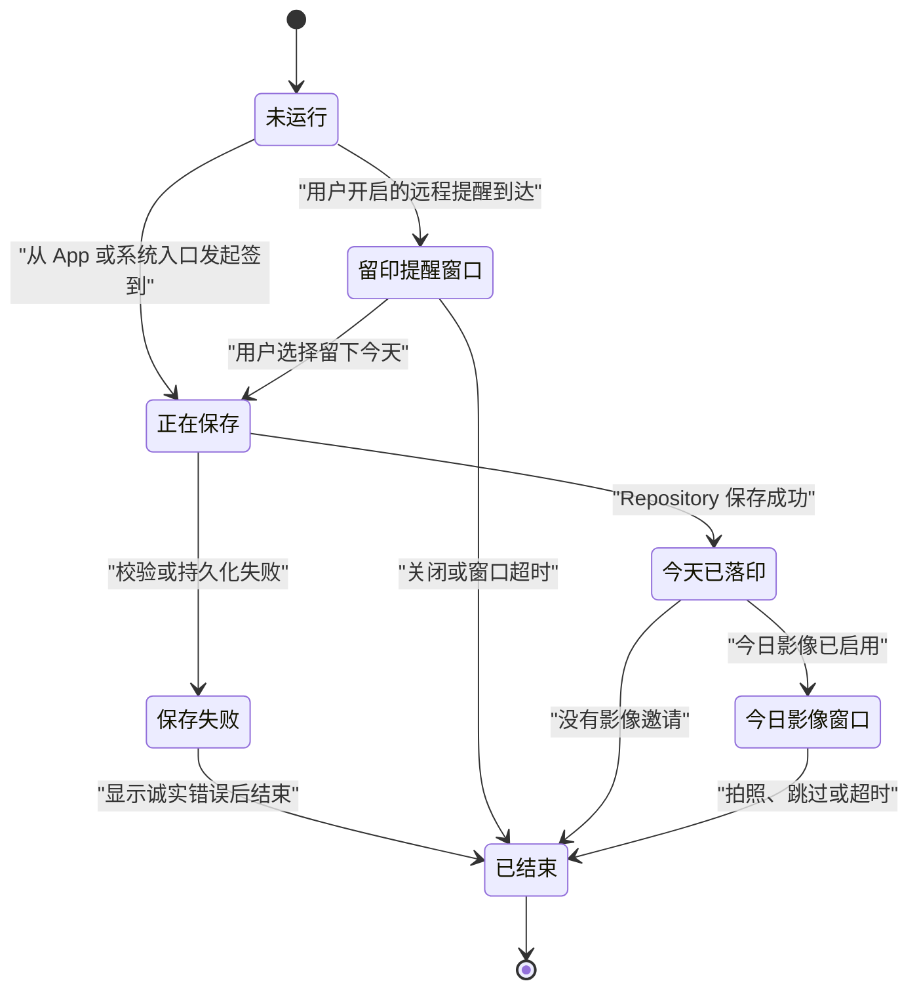

# 一日一印（Pulse）系统仪式产品与交互合同

文档版本：0.1<br>
状态：Proposed Product Contract，不改变 1.0 已冻结范围<br>
评审日期：2026-08-11

本文是 Pulse 在 Widget、Live Activity、灵动岛、锁屏、StandBy、Control、Action Button 和提醒通道上的产品语义权威。它定义“什么时候出现、表达什么、如何结束、什么可以收费”；签到日期、唯一性、删除和时区仍只以 [DOMAIN_CONTRACT.md](./DOMAIN_CONTRACT.md) 为准，版本顺序只以 [POST_1_0_ROADMAP.md](./POST_1_0_ROADMAP.md) 为准。

## 1. 产品结论

Pulse 不把系统表面当作更多通知位，而把它们组织成一套有开始、有变化、有结束的“日印仪式”：

> 在值得出现的时刻轻轻呼吸，见证完成时落下一印，让长期时间形成一圈年轮，然后安静离开。

三种正式动作语言：

- **呼吸**：提醒今天仍然空着，不催促、不威胁连续天数；
- **落印**：只有签到事实保存成功后，才表达今天已经完成；
- **年轮**：在回归、里程碑、照片积累和长期影片中表达时间复利。

决策边界：

| 场景 | 结论 | 原因 |
| --- | --- | --- |
| 基础 Home / Lock Screen Widget | GO，免费 | 最适合“今日状态 + 一步签到”，降低核心摩擦 |
| 签到成功的系统落印动效 | GO，免费 | 形成 Pulse 的品牌签名，但不替代 App 内反馈 |
| 签到后的今日影像窗口 | GO，影像实验通过后免费 | 把“完成今天”自然延伸为“留下今天” |
| 提醒时间自动出现的留印窗口 | 条件 GO | 必须用户主动开启，并有 ActivityKit push-to-start 与服务端证据 |
| 回归与里程碑变体 | GO，免费 | 只在用户本来就签到的时刻出现，不额外打扰 |
| 岁月流影生成进度 | GO，随 Plus 渲染能力提供 | 属于真实、持续变化、可取消的任务 |
| 全天常驻“今日未签到” | NO-GO | 没有合适的开始/结束，制造压力并长期占用系统表面 |
| 同时发送本地通知、灵动岛和微信提醒 | NO-GO | 重复表达同一事件，形成提醒轰炸 |
| 在灵动岛、锁屏默认显示面孔 | NO-GO | 可能在 Always-On、StandBy、Watch 或旁人视线中泄露隐私 |

## 2. 两类 Live Activity

只定义两个有明确所有者的 Activity 类型，不为每个创意再建一条生命周期。

### 2.1 `DailyImprintActivity`

承担提醒窗口、签到写入状态、落印确认和签到后的影像邀请。它不保存签到事实，只展示当前流程的短期状态。



`Imprinted` 绝不能由按钮点击、乐观 UI 或推送回执直接进入；唯一条件是正式 Repository 已成功保存或幂等回读到当天既有 `CheckInRecord`。

### 2.2 `ImprintRenderActivity`

只承担岁月流影、年度档案等真实长任务的准备与编码进度：

```text
preparing → aligning → blending → encoding → completed / failed / cancelled
```

进度来自渲染任务的实际完成量，不用人为计时器伪造平滑百分比。Activity 失败或取消不能留下可被误认成完整成品的输出文件。

## 3. 系统表面分工

### 3.1 Widget：长期可扫视状态

首批免费范围：

- Lock Screen 圆形：只显示今日空心/实心印记；
- Lock Screen 矩形：最近七日脉冲，默认不显示主承诺文本；
- Home Screen 小号：日期、今日状态和签到按钮；
- Home Screen 中号：今日状态、主承诺和七日节律。

Widget 的未签到操作使用 `Button`，不使用可以反向切换的 `Toggle`。签到可从系统入口创建，但删除仍只在 App 内二次确认。设备锁定时交互遵循系统认证，不绕过锁屏。

Plus Widget 只展示真正属于 Plus 的信息，如 28/90/365 日节律、回归力、印期、年轮和用户主动开启的往年今日；不按尺寸收费，也不把免费统计换个布局后重新收费。

### 3.2 灵动岛与 Live Activity：短期事件和任务

Compact、Minimal、Expanded 和 Lock Screen 必须都能独立理解；有灵动岛的 iPhone 不是唯一验收设备。Compact / Minimal 不放长文案，只显示印记、剩余时间、照片邀请或真实进度。Expanded / Lock Screen 才显示解释和唯一主要操作。

灵动岛不是任意动画画布：单次 Widget / Live Activity 动画最长两秒，Always-On 降低亮度时系统不播放动画。App 内不能用箭头或文案强迫用户看向灵动岛；主签到反馈仍由 App 页面完成，系统落印是附加的品牌回声。

### 3.3 通知：一次到达

本地通知仍是免费、离线可用的基本提醒。自动 Live Activity 和未来微信提醒是可选通道，不与本地通知同时表达同一逻辑日的同一提醒。

唯一 `ReminderPolicy` 决定主通道和显式回退：

```text
primaryChannel = localNotification | liveActivity | weChat
fallbackChannel = none | localNotification
```

如果用户选择灵动岛提醒但设备不支持、授权关闭、push-to-start token 失效或远程任务未接受，才能按用户同意回退到本地通知。通道协调使用单调 revision；旧任务、旧权限结果和迟到回调不能恢复已经关闭的提醒。

## 4. 日印仪式场景

### 4.1 签到落印

目标不是小视频，而是两秒内完成的状态变化：

```text
空心印记 → 收缩为一点 → 轻微回弹 → 实心印记
```

- App 内先显示中性的写入反馈，不提前显示成功；
- 保存成功后，App 主控件和 Live Activity 都切换到“已落印”；
- 保存失败时不播放实心印记，Activity 显示最短诚实错误后结束；
- Reduce Motion 使用淡入和形状替换，不使用位移、缩放或连续呼吸；
- Always-On 直接显示最终静态状态；
- 正常完成后几秒内结束，若启用今日影像则转入影像窗口。

### 4.2 留印提醒窗口

只有用户主动开启“灵动岛提醒”后，才允许在提醒时间自动启动。窗口可选 10、20 或 30 分钟，每个逻辑日最多自动启动一次。

Compact 示例：

```text
○        18:42
```

Expanded 示例：

```text
今天还没有留下这一印
[ 留下今天 ]
```

正式语言可以是“今天还空着”“此刻，要不要留给未来？”“你随时可以回来”；禁止“即将断签”“赶快完成”“连续记录要失败了”、红色警告、抖动和惩罚性倒计时。

用户关闭、窗口超时或完成签到后立即结束。关闭后当天不再次自动出现；不能为提高点击率反复启动或同时补发同义通知。

### 4.3 今日影像窗口

仅在签到成功且用户已启用影像邀请时出现，默认持续 5 分钟，最长不超过 10 分钟：

```text
●        留一张今天
```

展开后只提供“拍照”一个主要操作，点击深链到 App 的今日相机。拍照、跳过、超时或用户关闭后结束，当天不再单独提醒拍照。Activity 不显示真实照片、文件名、拍摄地点、人脸轮廓结果或年龄推断。

### 4.4 回归与里程碑

这些不是新提醒，只改变正常签到成功后的两秒落印：

- 回归：未闭合圆弧合为实心印记，文案“今天，你回来了”；
- 第 7 枚：七个微点汇为一印；
- 第 30 枚：一圈细线闭合；
- 第 100 枚：数字短暂化为印记；
- 第 365 枚：两圈年轮扩散后静止。

不使用奖杯、火焰、彩纸、虚拟货币或“保持完美连续”的庆祝语言。里程碑只由正式签到事实派生，不持久化第二份徽章进度。

### 4.5 岁月流影进度

Compact 显示实际进度，如 `◐ 63%`；Expanded 显示当前阶段、照片数量、可解释的剩余时间和“取消”。成功后立即从灵动岛结束，可在 Lock Screen 保留短暂完成摘要；失败显示原因和进入 App 重试入口，不展示虚构完成状态。

## 5. 触发、频率与生命周期

- `DailyImprintActivity` 每个项目、逻辑日最多一个有效实例；
- 自动提醒每天最多启动一次，用户手工结束后不重启；
- 本地通知、灵动岛和微信对同一提醒只允许一个主通道实际发送；
- 签到成功会取消当天本地通知、远程提醒任务和当前 `ReminderWindow`；
- 照片邀请只能由签到成功转入，不能在签到前单独占用灵动岛；
- 正常日印仪式不超过 30 分钟，不利用 ActivityKit 的八小时上限做全天常驻；
- 渲染 Activity 只在用户主动创建导出任务后启动，结束、失败和取消都必须收口文件与状态；
- 系统可能压缩、隐藏或调整灵动岛呈现，任何业务完成都不能依赖用户看见动画。

自动在提醒时间启动 Live Activity 不能依赖现有本地通知调度器。正式方案需要用户主动授权、ActivityKit push-to-start token、APNs 和最小后端调度；没有这条证据链时只允许本地通知，或由用户点击通知后进入 App 再启动仪式。

Pulse 最低版本仍包含 iOS / iPadOS 17.0；Apple 在 17.1 及更早系统不支持通过 ActivityKit 推送自动启动 Live Activity。因此 17.0 / 17.1 只提供本地通知和用户主动启动的仪式，17.2 及以后才有资格进入远程自动启动分支。界面必须按真实系统能力展示，不提供点击后必然失败的伪开关。

## 6. 数据、隐私与失败边界

### 6.1 本地事实

- `CheckInRecord` 仍是今天是否签到的唯一事实；
- Widget、Live Activity、Control、Action Button 和 App 都调用同一个 Repository / command service；
- 不把 `isCheckedToday`、连续天数或 `activityState` 持久化成第二份业务真相；
- Widget / Activity 快照可缓存，但必须携带来源 revision、可丢弃、可重建，不能反向覆盖 store；
- Widget extension 与 App 共享 App Group 正式 store，迁移完成前只能深链打开 App，不能写 UserDefaults 兜底。

### 6.2 远程最小化

远程 Live Activity 调度只保存发送所需的最小数据：用户/设备匿名标识、push-to-start token、项目标识、时区、逻辑日、提醒时刻、窗口长度、策略 revision 和任务状态。

禁止上传：

- 面貌照片、缩略图或渲染帧；
- 注释、缺席原因和主承诺正文；
- 完整签到历史与统计；
- 人脸关键点、身份模板、年龄或其他敏感推断；
- APNs 密钥、微信密钥或服务端凭证到 App、仓库、日志、聊天和诊断导出。

用户关闭灵动岛提醒、撤销授权、清除数据或解绑设备时，必须取消任务并删除 token 映射。远程任务接受不等于系统已展示，push 回执也不等于用户已看见。

### 6.3 可见隐私

- Lock Screen、Always-On、StandBy、CarPlay、Mac 菜单栏和 Watch Smart Stack 默认只显示抽象印记和最小状态；
- 主承诺名称、连续天数、往年今日和照片分别提供显式可见性选择；
- 面貌照片默认永不进入 Live Activity；
- 隐私锁保护 App 内容，但不能被误认为已经自动保护所有系统表面；
- 无敏感信息时仍使用系统的隐私脱敏能力并完成锁定设备实测。

## 7. 视觉与动效合同

日印仪式沿用“iOS 原生语言 + 纯黑单色”：系统字体、SF Symbols、语义动态颜色和系统容器，不增加渐变、霓虹、多彩统计、玻璃卡片或独立插画风格。灵动岛 Compact / Minimal / Expanded 的背景由系统控制为不透明黑色；品牌个性来自几何、节奏和措辞，不来自强行改背景。

动效参数在设计实现前集中定义，不散落硬编码：

```text
breath       = 空心印记轻微变化，用于提醒出现
imprint      = 空心到实心，用于保存成功
return       = 开口圆弧闭合，用于中断后回归
yearRing     = 一至两圈扩散，用于事实里程碑
memory       = 印记旁出现相机轮廓，用于可选留影
render       = 实际进度环，用于岁月流影生成
```

每次动画最长两秒；不做无限循环呼吸。所有状态提供 Reduce Motion、Always-On、低对比背景、动态字体、VoiceOver 和纯静态等价表达。

## 8. 免费与 Pulse Plus

永久免费：

- App 内落印动画和系统落印语言；
- 用户在 App 完成签到后的短暂 Live Activity 回声；
- 回归与里程碑变体；
- 标准本地提醒；
- 基础 Home / Lock Screen Widget 与幂等签到；
- 影像功能进入生产后的签到后拍照窗口。

Pulse Plus 候选：

- 由服务端在提醒时间自动 push-to-start 的留印窗口；
- 提醒窗口长度、表达与经验证的个人节律策略；
- 正式多通道提醒和一致回退；
- 高级节律、印期、年轮和往年今日 Widget；
- 岁月流影高级渲染及其真实进度 Activity；
- 将来经用户需求验证的专注印刻 Live Activity。

收费对象是持续调度、个性策略、长期档案和高级生成价值，不是“解锁灵动岛皮肤”。权益到期不删除签到、照片、影片或报告，也不阻断免费本地提醒与基础 Widget。

## 9. 验收与停止条件

### 9.1 工程门禁

- App、Widget 和 Live Activity 同时签到仍只有一个 `CheckInRecord`；
- 只有保存成功或幂等回读后才显示实心落印；
- 逻辑日、提醒窗口和 Activity 结束全部使用项目签到时区；
- 每日自动启动上限、关闭后不重启、签到后取消和跨日换代均通过竞态测试；
- push token 轮换、撤权、APNs 延迟、重复与乱序回调不会恢复旧任务；
- iOS / iPadOS 17.0、17.1 与支持 push-to-start 的系统分别验证，旧系统明确回退本地通知；
- 不支持灵动岛、未授权、Always-On、Reduce Motion、设备锁定和系统压缩呈现均有完整降级；
- 本地通知、灵动岛和微信仲裁不会重复触达；
- Activity 失败只影响系统仪式，不阻塞签到、照片和导出事实。

### 9.2 产品与视觉门禁

- 至少 30 名支持设备的 TestFlight 用户完成 14 天实验；
- 用户能区分基础提醒、留印窗口和拍照邀请，不认为三者会同时轰炸；
- 自动灵动岛提醒必须有主动开启率、窗口内完成率、关闭率和系统 Live Activity 总撤权率证据；
- 出现频率增加不能降低 D7 / D28 留存或提升通知撤权；
- Compact、Minimal、Expanded、Lock Screen、StandBy、多个并发 Activity、来电和媒体占用均通过真机视觉检查；
- 两秒落印在 1× 真实设备录屏和逐帧检查中无跳变、截断、不可读、过度闪烁或错误成功；
- 用户评价集中在“舒服、细腻、记得住”，而不是“好看但打扰”或“像连续天数威胁”。

达到任一条件应停止或降频：同义提醒重复、关闭后重新出现、系统表面泄露照片、成功状态早于持久化、动画必须靠远程资源才能完成，或真实用户大量关闭 Live Activities。

## 10. 分阶段落点

| 阶段 | 日印仪式范围 |
| --- | --- |
| R1 | App Group 正式 store、基础 Widget、Widget AppIntent、免费落印语言与本地启动原型 |
| R2.5 | 签到成功后的今日影像窗口，不单独追拍照提醒 |
| R3 | ActivityKit push-to-start 原型、远程留印窗口、ReminderPolicy 通道仲裁；证据通过后才纳入 Plus |
| R4 | 岁月流影实际生成进度、取消、失败与完成摘要 |
| WX0 / WX1 | 复用 ReminderPolicy 和服务端调度基础设施，但微信资格与发送适配器独立门禁 |
| R5 | 高级 Widget、Control、Action Button、Shortcuts、Watch 与跨表面一致体验 |

## 11. 平台依据

- Live Activity 适合有明确开始和结束、持续不超过数小时的任务，并要求克制更新与敏感内容：[Live Activities HIG](https://developer.apple.com/design/human-interface-guidelines/live-activities)
- Widget / Live Activity 单次动画最长两秒，Always-On 低亮度不播放动画：[Animating data updates in widgets and Live Activities](https://developer.apple.com/documentation/widgetkit/animating-data-updates-in-widgets-and-live-activities)
- Widget App Intent、锁定设备认证与操作完成后的 timeline reload：[Adding interactivity to widgets and Live Activities](https://developer.apple.com/documentation/widgetkit/adding-interactivity-to-widgets-and-live-activities)
- Live Activity 最长活跃八小时，之后最多在锁屏保留四小时：[Displaying live data with Live Activities](https://developer.apple.com/documentation/activitykit/displaying-live-data-with-live-activities)
- 远程自动启动、更新和结束需要 push token、APNs 与服务端：[Starting and updating Live Activities with ActivityKit push notifications](https://developer.apple.com/documentation/activitykit/starting-and-updating-live-activities-with-activitykit-push-notifications)
- Widget 独立进程、timeline 预算、App Group 与隐私约束：[Developing a WidgetKit strategy](https://developer.apple.com/documentation/widgetkit/developing-a-widgetkit-strategy)
