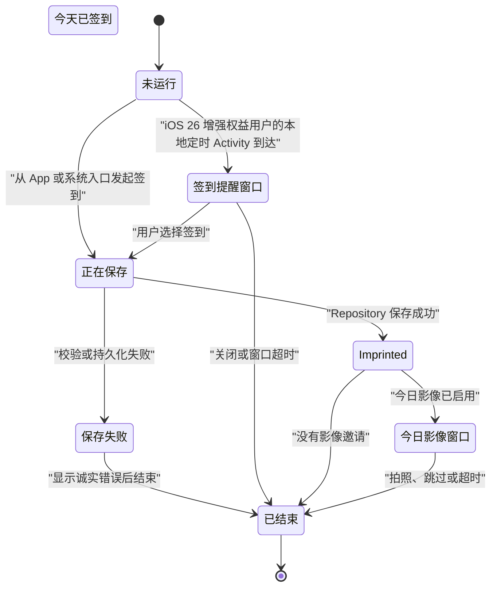

# 一日一印（Pulse）系统仪式产品与交互合同

文档版本：1.0<br>
状态：Canonical Ritual Semantics；1.1 包含 App 内基础签到、今日入镜与既有买断提醒窗口，其余能力受路线图门禁约束<br>
评审日期：2026-08-12

本文是 Pulse 在 Widget、Live Activity、灵动岛、锁屏、StandBy、Apple Watch、Control、Action Button 和提醒通道上的产品语义权威。它定义“什么时候出现、表达什么、如何结束、什么可以收费”；签到日期、影像独立性、唯一性、删除和时区仍只以 [DOMAIN_CONTRACT.md](./DOMAIN_CONTRACT.md) 为准，版本顺序只以 [PRODUCT_ROADMAP.md](./PRODUCT_ROADMAP.md) 为准。

## 1. 产品结论

Pulse 不把系统表面当作更多通知位，而把它们组织成一套有开始、有变化、有结束的“日印仪式”：

> 在值得出现的时刻轻轻呼吸，见证完成时落下一印，让长期时间形成一圈年轮，然后安静离开。

三种正式动作语言：

- **呼吸**：提醒今天仍然空着，不催促、不威胁连续天数；
- **落印**：只有签到事实保存成功后，才表达今天已经完成；
- **年轮**：在回归、里程碑、照片积累和长期影片中表达时间复利。

决策边界：

| 场景 | 结论 | 原因 |
| --- | --- | --- |
| 基础 Home / Lock Screen Widget | GO，免费 | 最适合“今日状态 + 一步签到”，降低核心摩擦 |
| Apple Watch 今日状态、表盘印记与可靠签到 | GO，免费基础能力 | 手腕最适合扫一眼和一次短动作，不能把核心便利本身锁进 Plus |
| Apple Watch 高级节律与长期档案 | GO，Plus 候选 | 28/90/365 日节律、印期与年轮会随数据持续产生新价值 |
| 签到成功的系统落印动效 | GO，免费 | 形成 Pulse 的品牌签名，但不替代 App 内反馈 |
| 签到后的今日入镜 | GO，1.1 免费正式能力 | 把“完成今天”自然延伸为“留下今天”，失败不撤销签到 |
| iOS 26 提醒时间自动出现的本地签到窗口 | GO，一次买断增强 | 必须用户购买并主动开启；使用 iOS 26 本地 scheduled Live Activity，不需要把 APNs/后端伪装成前置条件 |
| 本地通知提醒 | GO，永久免费 | 所有用户都应获得可靠基础提醒；同一逻辑日只允许一个正式通道，不复制提醒 |
| 回归与里程碑变体 | GO，免费 | 只在用户本来就签到的时刻出现，不额外打扰 |
| 岁月流影生成进度 | GO，随 Plus 渲染能力提供 | 属于真实、持续变化、可取消的任务 |
| 全天常驻“今日未签到” | NO-GO | 没有合适的开始/结束，制造压力并长期占用系统表面 |
| 同时发送本地通知、灵动岛和微信提醒 | NO-GO | 重复表达同一事件，形成提醒轰炸 |
| 在灵动岛、锁屏默认显示面孔 | NO-GO | 可能在 Always-On、StandBy、Watch 或旁人视线中泄露隐私 |

## 2. 两类 Live Activity

只定义两个有明确所有者的 Activity 类型，不为每个创意再建一条生命周期。

### 2.1 `DailyImprintActivity`

承担提醒窗口、签到写入状态、落印确认和签到后的影像邀请。它不保存签到事实，只展示当前流程的短期状态。



`Imprinted` 绝不能由按钮点击、乐观 UI 或推送回执直接进入；唯一条件是正式 Repository 已成功保存或幂等回读到当天既有 `CheckInRecord`。

### 2.2 `ImprintRenderActivity`

只承担岁月流影、年度档案等真实长任务的准备与编码进度：

```text
preparing → aligning → blending → encoding → completed / failed / cancelled
```

进度来自渲染任务的实际完成量，不用人为计时器伪造平滑百分比。Activity 失败或取消不能留下可被误认成完整成品的输出文件。

## 3. 系统表面分工

### 3.1 Widget：长期可扫视状态

首批正式范围：

- Lock Screen 圆形：今日开放环与实心完成印内部都显示由当前 `LogicalDay` 派生的本地化纯数字，不带“日”等日期后缀；待签到开放环不得带有会被误读为勾形的斜线，完成态以实心内核替代勾；
- Lock Screen 矩形：使用唯一“节律汇印”语法；左上显示今日短状态，过去六日节点上方显示不带日期后缀的本地化纯数字并以真实连接线汇入右侧唯一今日印记，今天数字显示在大印内部，不显示主承诺文本、星期或第七个今日小节点；
- Home Screen 小号/中号：待落之处是唯一面向所有用户的免费构图；高阶权益解锁星环 / 叠印 / 数影 / 手札 / 静场 / 来路 / 潮痕。八式是产品构图名；外观以渲染器与人工截图为准。各式按任务选择快照事实。正式枚举只含现行八式，未知标识失败关闭。

构图只是逐实例呈现选择：App Group 只允许 `PulseSharedSettings` 保存 `interface.language`、`reminder.enabled` 与 `reminder.timeMinutes`；后两项只用于 Widget Intent 提交签到后重建同一提醒计划。不得复制构图、签到记录、连续天数、日期、主承诺或购买状态。`WidgetConfigurationIntent` 是每个 Home Screen 实例的唯一构图来源；Widget extension 在生成每个 snapshot/timeline 时独立验证 entitlement，收费构图在权益未验证或撤销时明确显示未解锁，不得静默换成待落之处。Lock Screen / StandBy / Always-On 使用独立、无构图参数的 Accessory Widget kind，永久免费，不消费 Home Screen 构图，也不显示主承诺正文。App 与 Widget 内容消费同一语言；未知语言失败关闭，不能用系统语言伪装成功。

Widget 的未签到操作使用 `Button`，不使用可以反向切换的 `Toggle`。Accessory 待签到时整块系统分配区域都是同一按钮，不能只让图形局部可点；完成态静态。签到可从系统入口创建，但删除仍只在 App 内二次确认。设备锁定时交互遵循系统认证，不绕过锁屏。

Plus Widget 只展示真正属于 Plus 的信息，如 28/90/365 日节律、回归力、印期、年轮和用户主动开启的往年今日；不按尺寸收费，也不把免费统计换个布局后重新收费。

### 3.2 灵动岛与 Live Activity：短期事件和任务

Compact、Minimal、Expanded 和 Lock Screen 必须都能独立理解；有灵动岛的 iPhone 不是唯一验收设备。Compact / Minimal 的印记就是日晕本身：待签为萤火点，已签为实心印，不画开口环，也不显示提醒时间。萤火须带可见光晕，体积明显大于系统隐私指示点。Expanded 为印记、状态标题、提醒时间与唯一签到动作；岛内签到键低调，不抢萤火。Lock Screen 才使用开口弧与端点萤火，并同时给出标题、时间与签到。不加入陪伴式解释或动机文案。

灵动岛不是任意动画画布：单次 Widget / Live Activity 动画最长两秒，Always-On 降低亮度时系统不播放动画。App 内不能用箭头或文案强迫用户看向灵动岛；主签到反馈仍由 App 页面完成，系统表面只是附加的品牌回声。

### 3.3 通知：一次到达

基础本地通知提醒永久免费。已购买增强的用户在支持且允许 Live Activities 的 iOS 26 系统上使用本地定时 Live Activity；未购买、iOS 18–25 或 iOS 26 关闭 Live Activities 时使用免费本地通知。未来远程 Live Activity 和微信提醒仍是后续候选，不能与当前主通道同时表达同一逻辑日的同一提醒。

唯一 `PulseReminderDeliveryPolicy` 决定正式通道：

```text
deliveryMode = disabled | localNotification | scheduledLiveActivity
```

只有用户关闭提醒时才为 `disabled`。未购买时主通道是 `localNotification`；已购买 iOS 26 设备在 Live Activities 被关闭时也选择本地通知。仅在用户主动开启提醒时请求通知权限；它既服务免费基础触达，也覆盖 ActivityKit 有限计划容量之外的长期日期。拒绝通知时不能承诺连续提醒，因此不启用提醒。iOS 26 不因设备没有灵动岛而改变通道，Lock Screen Live Activity 仍是正式表面。通道协调使用单调 revision；旧任务、旧权限结果和迟到回调不能恢复已经关闭的提醒。

## 4. 日印仪式场景

### 4.1 签到落印

目标不是小视频，而是两秒内完成的事实状态变化：

```text
深草行动印（空心内核）→ 权威提交 → 鲜草完成印（实心内核）
```

- App 内先显示中性的写入反馈，不提前显示成功；
- 保存成功后，App 主控件和 Live Activity 都切换到“已签到”；
- 保存失败时不播放实心印记；系统报告 Intent 失败，Activity 保持待签到以允许重试；
- Reduce Motion 使用淡入和形状替换，不使用位移、缩放或连续呼吸；
- Always-On 直接显示最终静态状态；
- 单击只签到；长按 0.45 秒表示“签到并拍照”，在权威提交成功后才请求相机；相机失败不回滚签到。

App 内落印仪式独立于 Live Activity（后者见 4.2），当前规则如下：

- 待签到：深草绿色行动印内保留空心内核；页面进入时外部低强调光环最多完成一次有限呼吸，不持续循环；
- `saving`：只显示中性写入反馈，不能出现实心印记、成功触觉或完成时间；
- 已签到：仅由 Repository 的正式提交回执触发，切换为鲜草绿并形成实心内核，随后停在静态状态；
- 保存失败：恢复深草行动印与空心内核，保留可重试入口并显示真实错误，不播放成功动效或触觉；
- 已签到状态在启动、回前台或重建 View 时直接显示静态完成印，不得重播一次用户并未刚刚完成的仪式。

App 内页面只保存短暂的呈现阶段和动画进度，不持久化 `activityState`，也不把呈现阶段作为签到事实。一次正常落印总时长不得超过两秒；Reduce Motion 只做短淡入与形状替换，不做缩放、回弹或扩散。

### 4.2 签到提醒窗口

只有 StoreKit 已验证高阶权益且用户主动开启提醒后，才允许在提醒时间自动启动 Live Activity；未购买用户在同一提醒时间使用免费本地通知。首版使用 standard Live Activity，每个逻辑日最多自动启动一次，保留到用户直接签到、从 App/Widget 签到或由系统结束；Pulse 不用 `staleDate` 伪造定时结束。设置页不能把 Live Activity 写成“仅灵动岛”，因为无灵动岛设备仍使用 Lock Screen 表面。

Compact / Minimal：待签为萤火点，已签为实心印；不显示提醒时间。

Expanded：

```text
[印]  今日未签到     [签到]
      18:42
```

Lock Screen：

```text
[环]  今日未签到     [签到]
      18:42
```

锁屏时间在标题下，不使用独立时间胶囊。

正式系统表面只使用“今日未签到”“签到”“今日已签到”等事实与动作词；禁止“准备好时”“你随时可以回来”等陪伴式引导，也禁止“即将断签”“赶快完成”“连续记录要失败了”、红色警告、抖动和惩罚性倒计时。

用户关闭提醒或完成签到后结束。关闭后当天不再次自动出现；不能为提高点击率反复启动或同时补发同义通知。

### 4.3 今日影像窗口

仅在签到成功且用户已启用影像邀请时出现，默认持续 5 分钟，最长不超过 10 分钟：

```text
●        留一张今天
```

展开后只提供“拍照”一个主要操作，点击深链到 App 的今日相机。拍照、跳过、超时或用户关闭后结束，当天不再单独提醒拍照。Activity 不显示真实照片、文件名、拍摄地点、人脸轮廓结果或年龄推断。

### 4.4 回归与里程碑

这些不是新提醒，只改变正常签到成功后的两秒落印：

- 回归：未闭合圆弧合为实心印记，文案“今天，你回来了”；
- 第 7 枚：七个微点汇为一印；
- 第 30 枚：一圈细线闭合；
- 第 100 枚：数字短暂化为印记；
- 第 365 枚：两圈年轮扩散后静止。

不使用奖杯、火焰、彩纸、虚拟货币或“保持完美连续”的庆祝语言。里程碑只由正式签到事实派生，不持久化第二份徽章进度。

### 4.5 岁月流影进度

Compact 显示实际进度，如 `◐ 63%`；Expanded 显示当前阶段、照片数量、可解释的剩余时间和“取消”。成功后立即从灵动岛结束，可在 Lock Screen 保留短暂完成摘要；失败显示原因和进入 App 重试入口，不展示虚构完成状态。

## 5. 触发、频率与生命周期

- `DailyImprintActivity` 每个项目、逻辑日最多一个有效实例；
- 自动提醒每天最多启动一次，用户手工结束后不重启；
- 本地通知、灵动岛和微信对同一提醒只允许一个主通道实际发送；
- 签到成功会取消当天本地通知、远程提醒任务和当前 `ReminderWindow`；
- 照片邀请只能由签到成功转入，不能在签到前单独占用灵动岛；
- standard 提醒在权威签到后先显示短暂完成态再结束；不得跨逻辑日常驻；
- 渲染 Activity 只在用户主动创建导出任务后启动，结束、失败和取消都必须收口文件与状态；
- 系统可能压缩、隐藏或调整灵动岛呈现，任何业务完成都不能依赖用户看见动画。
- iPhone 与 Apple Watch 对同一提醒只触达一次；不在 Watch 再建立一套独立每日通知计划来争夺注意力；

iOS 26 的正式方案使用 ActivityKit 本地 `start:` 调度，不借本地通知触发、不要求 App 在后台执行，也不需要 APNs。调度器先提交最多 7 个 standard Activity，再从第一个未获接受的逻辑日起用本地通知补齐滚动 60 日窗口；若 ActivityKit 只接受前缀，已接受日期保留，剩余日期转本地通知，同一天不双发。7 是 Pulse 的产品上限，不是对系统容量的承诺。系统可因设备预算、用户设置或并发 Activity 拒绝、延迟、压缩或隐藏呈现，产品不能承诺“到点必现”。

Pulse 最低版本为 iOS / iPadOS 18.0，因此只保留两条正式版本分支：iOS 26 的 scheduled Live Activity 与 iOS 18–25 的本地通知。未来若实现跨更长时间、服务端个性策略或远程启动，仍必须另行具备 push-to-start token、APNs 和最小后端证据链；不能把远程通道混进本轮本地买断功能。

## 6. 数据、隐私与失败边界

### 6.1 本地事实

- `CheckInRecord` 仍是今天是否签到的唯一事实；
- Widget、Live Activity、Control、Action Button 和 App 都调用同一个 Repository / command service；
- 不把 `isCheckedToday`、连续天数或 `activityState` 持久化成第二份业务真相；
- Widget / Activity 快照可缓存，但必须携带来源 revision、可丢弃、可重建，不能反向覆盖 store；
- Widget extension 与 App 共享 App Group 正式 store，迁移完成前只能深链打开 App，不能写 UserDefaults 兜底。

### 6.2 远程最小化

远程 Live Activity 调度只保存发送所需的最小数据：用户/设备匿名标识、push-to-start token、项目标识、时区、逻辑日、提醒时刻、窗口长度、策略 revision 和任务状态。

禁止上传：

- 面貌照片、缩略图或渲染帧；
- 注释、缺席原因和主承诺正文；
- 完整签到历史与统计；
- 人脸关键点、身份模板、年龄或其他敏感推断；
- APNs 密钥、微信密钥或服务端凭证到 App、仓库、日志、聊天和诊断导出。

用户关闭灵动岛提醒、撤销授权、清除数据或解绑设备时，必须取消任务并删除 token 映射。远程任务接受不等于系统已展示，push 回执也不等于用户已看见。

### 6.3 可见隐私

- Lock Screen、Always-On、StandBy、CarPlay、Mac 菜单栏和 Watch Smart Stack 默认只显示抽象印记和最小状态；
- 连续天数、往年今日和照片分别提供显式可见性选择；主承诺名称只进入 Home Screen 基础 Widget，Lock Screen、Always-On、StandBy 等表面不渲染；可选说明不进入任何 Widget；
- 面貌照片默认永不进入 Live Activity；
- 隐私锁保护 App 内容，但不能被误认为已经自动保护所有系统表面；
- 无敏感信息时仍使用系统的隐私脱敏能力并完成锁定设备实测。

## 7. 视觉与动效合同

日印仪式使用 iOS 原生能力 + 语义色令牌；外观以代码与人工截图为准。不伪造成功、不建第二套相机品牌、不把照片反定全局事实。灵动岛背景由系统控制时，用形状与措辞保持身份即可。

动效参数在设计实现前集中定义，不散落硬编码：

```text
breath       = 提醒出现：灵动岛萤火点，锁屏开口弧
imprint      = 签到成功：灵动岛实心印，锁屏闭合弧
return       = 开口圆弧闭合，用于中断后回归
yearRing     = 一至两圈扩散，用于事实里程碑
memory       = 印记旁出现相机轮廓，用于可选留影
render       = 实际进度环，用于岁月流影生成
```

状态转换动画每次最长两秒，不对按钮、文字或状态控件做无限循环。App 根场域允许唯一的 18 秒低振幅环境呼吸与细线漂移：只在前台且 Reduce Motion 关闭时由时间轴驱动，失活后暂停；它不改变业务状态，也不进入 Widget、Live Activity 或 Always-On。所有状态提供 Reduce Motion、低对比背景、动态字体、VoiceOver 和纯静态等价表达。

## 8. 免费与 Pulse Plus

永久免费：

- App 内落印动画和系统落印语言；
- 用户在 App 完成签到后的短暂 Live Activity 回声；
- 回归与里程碑变体；
- 基础本地通知提醒；
- Home Screen「待落之处」、全部 Lock Screen Widget 与幂等签到；
- 影像功能进入生产后的签到后拍照窗口。

一次买断高阶权益：

- 静野与晴昼两套额外界面主题；纸页手记是唯一免费默认，三套主题的签到、历史、记事、照片、统计和无障碍能力必须等价；
- 高级功能页按能力目录展示静野与晴昼的不可交互同源标本；标本与设置中的主题预览共用同一渲染器，不得启用主题、不得包含纸页手记商品位；
- iOS 26 本地定时 standard Live Activity，统一使用“萤火日晕”标志性构图并支持从系统表面直接签到；支持设备由系统同时提供 Dynamic Island，其他设备显示 Lock Screen 表面。提醒时间、时区和逻辑日随 Activity attributes 传入，构图不作为用户偏好持久化；
- 高级功能页使用不可交互的同源预览同时展示 Expanded、Compact、Minimal、完成态与 Lock Screen；预览不得调用签到 Intent，也不得用说明性长文案替代实际形态；
- Home Screen「星环 / 叠印 / 数影 / 手札 / 静场 / 来路 / 潮痕」七种额外构图；
- 一个商品、一个永久 entitlement；商品价格从 StoreKit 返回值读取，不持久化购买布尔副本；`PulseEnhancementContract.currentCapabilities` 是购买页当前已交付能力的唯一目录。

Pulse Plus 候选：

- 由服务端进行更长周期、跨设备或个性策略的远程 push-to-start 签到窗口；
- 提醒窗口长度、表达与经验证的个人节律策略；
- 正式多通道提醒和一致回退；
- 高级节律、印期、年轮和往年今日 Widget；
- 岁月流影高级渲染及其真实进度 Activity；
- Apple Watch 上的 28/90/365 日节律、回归力、印期、年轮和往年今日抽象回看；
- 将来经用户需求验证的专注印刻 Live Activity。

高阶权益当前收费对象是“增强系统呈现 + 七种额外构图”，不是基础提醒可靠性。未来能力只有真正交付后才能加入统一能力目录和权益页，不能预售路线图。无灵动岛设备仍可获得 Lock Screen Live Activity 表面，所有用户都保留本地通知、App 内基础签到与免费的待落之处构图。权益不可用或被撤销时，提醒继续按基础本地通知策略协调，收费 Home Screen 构图明确显示未解锁并提供恢复购买或改用待落之处的路径；不得删除签到、照片、影片、报告、备份或 Widget。

## 9. Apple Watch 子系统

### 9.1 产品角色与首发边界

Apple Watch 不是缩小版 iPhone，也不是第二套签到应用。它只承担“扫一眼今天、完成一个动作、收到克制确认”，完整历史、删除、时区修改、照片管理、导出与付费管理仍回到 iPhone。

R5 首发采用 **iPhone 伴侣型 Watch App**，候选最低版本为 watchOS 10，以 WidgetKit complication 和 Smart Stack 为基础；iPhone Live Activity 自动进入 Watch Smart Stack 仅属于 watchOS 11 及以后能力。独立 Watch App、蜂窝网络独立同步和手表端完整历史暂缓；这些能力会引入账户、CloudKit、冲突和删除的新合同，不能假装只是多加一个 target。正式最低版本还要结合目标用户设备占比和真机矩阵冻结。

永久免费首发面：

- Watch App 今日页：抽象印记、主承诺（默认可隐藏）、今日状态、一个大签到按钮和最近七日脉冲；
- 表盘复杂功能（complication）：圆形空心/实心印记、矩形今日状态或七日脉冲；
- Smart Stack：今日状态和一个可执行的签到动作；
- watchOS 11 及以后：iPhone `DailyImprintActivity` 在 Watch Smart Stack 的系统呈现，以及必要的 Watch 专用紧凑布局；
- 提交中、待同步、已签到、失败的诚实状态与触觉区分。

Plus 只增加 28/90/365 日节律、回归力、印期、年轮、往年今日抽象回看和更多用户主动选择的信息密度。基础 Watch App、基础 complication、Smart Stack 和可靠签到不收费；也不按表盘样式或尺寸重复收费。

### 9.2 手腕上的日印语言

Watch 使用与 iPhone 相同的“呼吸、落印、年轮”，但更短、更静：

| Watch 状态 | 视觉 | 触觉 | 允许的文案 |
| --- | --- | --- | --- |
| `ready` | 空心印记 | 无 | 今天还未签到 |
| `submitting` | 单次收缩或系统进度 | 无成功触觉 | 正在确认 |
| `pendingSync` | 带缺口的印记 | 中性单次触觉 | 已记录，等待同步 |
| `committed` | 空心落为实心 | 一次轻量成功触觉 | 今天已签到 |
| `failed` | 恢复空心并显示最短错误 | 一次不同于成功的告警触觉 | 未保存，请重试 / 在 iPhone 确认 |

`pendingSync` 不能使用实心印记、成功绿色、勾号或与 `committed` 相同的触觉。只有 iPhone 权威 Repository 确认新建或幂等命中当天 `CheckInRecord` 后，Watch 才能落下实心印记。

提醒到来时最多一次极轻的“呼吸”触觉和静态空心印记，不连续震动、不做惩罚性倒计时。Always-On 使用最终静态形状；Reduce Motion 只做淡入与形状替换。Watch 不显示奖杯、火焰、彩纸或“断签警告”。

### 9.3 读取快照与签到命令

两台设备之间不能共享同一 SQLite 文件。iPhone 正式 store 仍是唯一业务真源；Watch App 与 Watch Widget 只共享本机可丢弃的展示快照和命令 outbox。

从 iPhone 到 Watch 的 `WatchProjectSnapshot` 至少包含：

```text
projectID
projectRevision
displayName / privacyMode
projectTimeZoneIdentifier
logicalDay
isChecked
checkedAt
sevenDayPulse
lastAcknowledgedOperationID
generatedAt
```

它适合通过会覆盖旧值的 latest-context 通道更新，因为 Watch 只需要最新显示状态；快照可以缓存和重建，不能反向写回 iPhone store，也不能在 Watch 端演变成第二份签到历史。

Watch 点击签到时先在本机 durable outbox 创建 `WatchCheckInCommand`，而不是创建 `CheckInRecord`：

```text
operationID: UUID
projectID: UUID
projectRevision
occurredAt: UTC instant
projectTimeZoneIdentifierSnapshot
createdAt
```

- `operationID` 在重试、快速发送与后台传输之间保持不变；
- iPhone 收到命令后仍通过正式 command service / `SwiftDataPulseRepository` 写入；
- 逻辑日、唯一 `recordKey` 和迟到命令语义由领域合同决定，Watch 不自行裁决最终逻辑日；
- Watch 不提供任意日期参数、补签、删除或修改签到时间；
- iPhone 回执至少包含 `operationID`、正式逻辑日、记录标识/时间和成功或失败原因；Watch 收到回执后才能清除 outbox 并进入 `committed`；
- 同一命令重复送达，以及 iPhone、Widget、Live Activity 与 Watch 同时签到，都必须幂等收敛为同一天一条记录。

传输策略是一条业务路径、两种速度：伴侣当前可达时用即时消息快速取得回执；不可达、超时或 App 退到后台时，用保证排队交付的后台用户信息继续传输。两条传输都携带同一 `operationID`，不能各自实现一套保存逻辑。最新状态快照不能承担签到命令，因为覆盖语义可能吞掉动作。

跨午夜、Watch 快照时区过期、项目已重建或命令迟到到下一逻辑日时，首版不得静默把动作记到错误日期。领域合同没有明确裁决前，命令保留为 `pendingSync`，并提示“在 iPhone 确认”。正式开发前必须先在 `DOMAIN_CONTRACT.md` 新增“延迟到达的当时签到命令”语义和测试；此处不越权定义补签。

### 9.4 Smart Stack、complication 与 Live Activity

- complication 是安静的长期扫视面，只显示最新快照；没有新鲜快照时表达“需要同步”，不猜测今天状态；
- Smart Stack 可在用户提醒时间附近提交更高相关性，但最终是否出现、排在何处由系统决定，产品文案不能承诺“到点一定浮上来”；
- Watch App 与 complication/Smart Stack 的交互通过 App Intent 进入同一 Watch 命令 outbox；Widget 扩展不能另写一份完成状态；
- watchOS 11 及以后，iPhone `DailyImprintActivity` 会在配对 Watch 的 Smart Stack 中出现；watchOS 10 没有这条表面，仍使用普通 Smart Stack Widget。Pulse 不再复制一条“Watch Live Activity”；可提供 Watch 专用布局，但状态仍来自同一 Activity 与签到命令；
- iPhone 开启今日影像后，Watch 只提示“稍后用 iPhone 留一张今天”。Watch 没有相机，也不声称能远程替用户打开 iPhone 相机；
- 岁月流影渲染时，Watch 最多显示抽象真实进度与完成入口，默认不显示面孔帧。

### 9.5 提醒仲裁与隐私

Apple Watch 依赖系统的通知路由和 iPhone 的唯一 `ReminderPolicy`，不建立第二个每日提醒调度器。同一逻辑日、同一提醒事件只能由本地通知、Live Activity 或微信中的一个主通道发出；系统把 iPhone 通知路由到 Watch 不算新通道，也不能因此再补一次 Watch 自定义提醒。

Watch 默认隐私等级高于 App 前台：

- complication、Smart Stack、通知与 Always-On 默认只显示抽象印记；
- 主承诺、连续天数、往年今日和长期节律分别由用户显式开启；
- 面貌照片、缩略图、文件名、地点、注释、缺席原因、人脸关键点与年龄推断永不进入默认 Watch 表面；
- 手表丢失、取消配对、退出项目或清除数据后，iPhone 与 Watch 两端快照/outbox 都有可验证清理路径。

### 9.6 Watch 验收门禁

- WatchConnectivity 的后台排队传输必须在真实配对 iPhone 与 Apple Watch 上验证；模拟器结果不能替代；
- 覆盖 iPhone/Watch 前台、后台、强退、重启、飞行模式、蓝牙/Wi-Fi 变化、失联后恢复和 Watch App 重装；
- 覆盖提醒前后、逻辑日午夜两侧、项目时区变化、旧快照、重复/乱序/迟到命令和两端同时签到；
- 任一路径都不产生第二条 `CheckInRecord`，也不让 `pendingSync` 冒充成功；
- 通知实际路由到 iPhone 或 Watch 时只有一次触达，关闭后当天不重来；
- complication、Smart Stack、Watch App，以及 watchOS 11+ 的 Live Activity，在最小/最大支持表盘、Always-On、Dynamic Type、VoiceOver、Reduce Motion 和锁定隐私下通过真机视觉验收；
- 不高频刷新 complication、不持续动画、不轮询连接；完成 14 天电量观察后才进入生产；
- 基础 Watch 入口的采用率和可靠性先独立成立，再评估 Plus 高级节律，不用付费转化掩盖同步失败。

任一条件触发 Watch 阶段 `NO-GO`：无法区分待同步与已保存、必须维护第二份签到数据库、跨午夜会静默错日、提醒重复、面孔默认暴露，或只有模拟器证据没有配对真机证据。

## 10. 验收与停止条件

### 10.1 工程门禁

- App、Widget 和 Live Activity 同时签到仍只有一个 `CheckInRecord`；
- 只有保存成功或幂等回读后才显示实心落印；
- 逻辑日、提醒窗口和 Activity 结束全部使用项目签到时区；
- 每日自动启动上限、关闭后不重启、签到后取消和跨日换代均通过竞态测试；
- iOS 26 本地 scheduled Activity 的容量拒绝、部分成功、撤权和重新协调不会恢复旧任务或产生双通道；
- iOS / iPadOS 18–25 与 26 分别验证免费本地通知、scheduled Activity、Live Activities 关闭后的通道切换；
- 不支持灵动岛、未授权、Always-On、Reduce Motion、设备锁定和系统压缩呈现均有正式定义；
- 本地通知、灵动岛和微信仲裁不会重复触达；
- Activity 失败只影响系统仪式，不阻塞签到、照片和导出事实。

### 10.2 产品与视觉门禁

- TestFlight 实验在开始前登记要判断的风险、支持设备分层、观察窗口、最小有意义效应、样本停止规则；不存在通用的“30 人才准继续开发”门槛，但无真实用户和真机证据时也不得宣布产品或系统表面 GO；
- 用户能区分基础提醒、签到窗口和拍照邀请，不认为三者会同时轰炸；
- 自动灵动岛提醒必须有主动开启率、窗口内完成率、关闭率和系统 Live Activity 总撤权率证据；
- 出现频率增加不能降低 D7 / D28 留存或提升通知撤权；
- Compact、Minimal、Expanded、Lock Screen、StandBy、多个并发 Activity、来电和媒体占用均通过真机视觉检查；
- 两秒落印在 1× 真实设备录屏和逐帧检查中无跳变、截断、不可读、过度闪烁或错误成功；
- 用户评价集中在“舒服、细腻、记得住”，而不是“好看但打扰”或“像连续天数威胁”。

达到任一条件应停止或降频：同义提醒重复、关闭后重新出现、系统表面泄露照片、成功状态早于持久化、动画必须靠远程资源才能完成，或真实用户大量关闭 Live Activities。

## 11. 分阶段落点

| 阶段 | 日印仪式范围 |
| --- | --- |
| R0.5 | 首版免费基础提醒 + 高阶权益：StoreKit 2 单一永久 entitlement、iOS 26 本地 scheduled Live Activity、待落之处免费与七种额外逐实例 Home Screen 物件构图与单通道仲裁 |
| R1 | App Group 正式 store、基础 Widget、Widget AppIntent、免费待落之处与后续系统仪式原型 |
| W0 | R1 稳定后提前验证配对真机、WatchConnectivity、`pendingSync` 与跨午夜命令；不写生产历史 |
| 1.1 | 签到成功后的今日入镜，不单独追拍照提醒，照片不进入系统表面 |
| R3 | ActivityKit push-to-start 原型、远程签到窗口与多通道仲裁；不得向买断用户重复销售现有本地提醒能力 |
| R4 | 岁月流影实际生成进度、取消、失败与完成摘要 |
| WX0 / WX1 | 复用 ReminderPolicy 和服务端调度基础设施，但微信资格与发送适配器独立门禁 |
| R5 | 伴侣型 Watch App、基础 complication / Smart Stack / 可靠签到免费；高级 Watch 节律、Widget、Control、Action Button 与 Shortcuts 分层验证 |

## 12. 平台依据

- Live Activity 适合有明确开始和结束、持续不超过数小时的任务，并要求克制更新与敏感内容：[Live Activities HIG](https://developer.apple.com/design/human-interface-guidelines/live-activities)
- iOS 26 可用 `start:` 在本地安排 Live Activity；scheduled Activity 计入设备相关并发上限，standard Activity 必须由 App 的权威状态转换结束，`staleDate` 只表示内容过期：[Displaying live data with Live Activities](https://developer.apple.com/documentation/activitykit/displaying-live-data-with-live-activities)
- Widget / Live Activity 单次动画最长两秒，Always-On 低亮度不播放动画：[Animating data updates in widgets and Live Activities](https://developer.apple.com/documentation/widgetkit/animating-data-updates-in-widgets-and-live-activities)
- Widget App Intent、锁定设备认证与操作完成后的 timeline reload：[Adding interactivity to widgets and Live Activities](https://developer.apple.com/documentation/widgetkit/adding-interactivity-to-widgets-and-live-activities)
- Live Activity 最长活跃八小时，之后最多在锁屏保留四小时：[Displaying live data with Live Activities](https://developer.apple.com/documentation/activitykit/displaying-live-data-with-live-activities)
- 远程自动启动、更新和结束需要 push token、APNs 与服务端：[Starting and updating Live Activities with ActivityKit push notifications](https://developer.apple.com/documentation/activitykit/starting-and-updating-live-activities-with-activitykit-push-notifications)
- Widget 独立进程、timeline 预算、App Group 与隐私约束：[Developing a WidgetKit strategy](https://developer.apple.com/documentation/widgetkit/developing-a-widgetkit-strategy)
- Watch 体验应简短、可扫视，并由 Watch App、complication、通知和 Smart Stack 分工：[watchOS apps](https://developer.apple.com/documentation/watchos-apps/)
- 从 watchOS 11 起，iPhone Live Activity 会进入配对 Watch 的 Smart Stack，Watch App 可提供专用布局与交互：[What’s new in watchOS 11](https://developer.apple.com/videos/play/wwdc2024/10205/)
- 最新上下文、保证排队的用户信息、即时消息与真机验证边界：[Transferring data with Watch Connectivity](https://developer.apple.com/documentation/watchconnectivity/transferring-data-with-watch-connectivity)
- Smart Stack 相关性只是提供给系统的建议，最终排序和出现由系统决定：[Widget suggestions in Smart Stacks](https://developer.apple.com/documentation/widgetkit/widget-suggestions-in-smart-stacks)
- WidgetKit complication、Smart Stack 与交互式 App Intent：[Creating accessory widgets and watch complications](https://developer.apple.com/documentation/widgetkit/creating-accessory-widgets-and-watch-complications)
